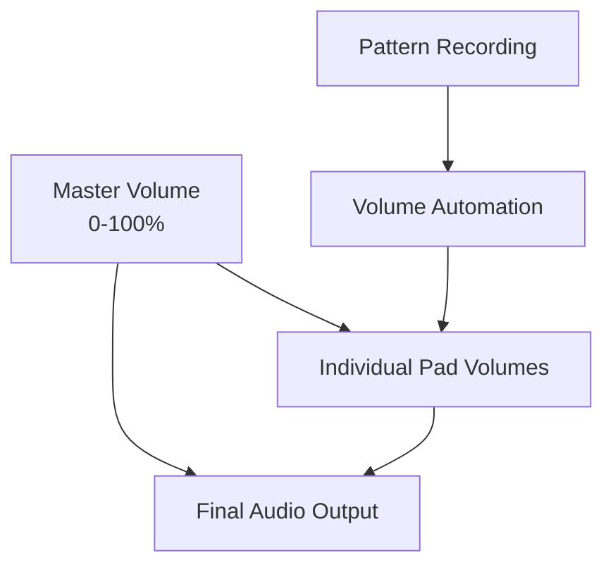

# 🎵 BeatBox Studio Pro

<div align="center">

**🎛️ Professional Beat Creation & Music Production App 🎛️**

*Powered by **HexlordDev***

---

**Transform your mobile device into a professional beat-making studio!**  
*Create, mix, and share incredible beats with our feature-packed music production app.*


</div>

---

## 📋 Table of Contents

- [✨ Features Overview](#-features-overview)
- [🚀 Quick Start Guide](#-quick-start-guide)
- [🎛️ Interface Guide](#️-interface-guide)
- [🎨 Sound Packs](#-sound-packs)
- [🎚️ Audio Controls](#️-audio-controls)
- [📱 Technical Features](#-technical-features)
- [🔧 Settings & Preferences](#-settings--preferences)
- [🎯 Pro Tips](#-pro-tips)
- [🌟 Advanced Features](#-advanced-features)
- [📞 Support & Community](#-support--community)
- [🎵 Credits](#-credits)

---

## ✨ Features Overview

### 🎯 Core Beat Making
| Feature | Description |
|---------|-------------|
| **8 Dynamic Sound Pads** | Tap to create beats with visual feedback |
| **3 Professional Sound Packs** | Trap, House, and Dubstep styles |
| **Advanced Audio Engine** | High-quality sound playback with volume control |
| **Real-time Beat Visualization** | See your beats come to life |

### 🎚️ Professional Mixing
> **Advanced mixing capabilities for professional results**

- ✅ **Individual Volume Controls** - Fine-tune each sound
- ✅ **Master Volume Control** - Overall audio management  
- ✅ **Audio Mixer Interface** - Professional mixing board experience
- ✅ **Volume Indicators** - Visual feedback for sound levels

### 🎪 Sound Effects & Enhancement
```
🔊 Available Effects:
├── Reverb    - Adds space and depth
├── Delay     - Echo effects  
├── Distortion - Adds grit and power
├── Filter    - Frequency filtering
├── Chorus    - Thickens sound
└── Phaser    - Sweeping effect
```

**Visual Enhancements:**
- 🌟 Particle Effects when effects are active
- 📳 Haptic Feedback for better experience  
- ✨ Glow Animations on pad interactions

### 📹 Recording & Playback
> **Capture and replay your musical ideas**

| Control | Function |
|---------|----------|
| 🔴 **Pattern Recording** | Record your beat sequences |
| ⏱️ **Tempo Control** | Adjust BPM from 60-200 |
| 🔄 **Loop Mode** | Continuous playback of patterns |
| ⏯️ **Playback Controls** | Start, stop, and manage playback |
| 🎚️ **Volume Recording** | Capture volume variations in patterns |

### 💾 Pattern Management
- 💿 **Save & Name Patterns** - Organize your creations
- 📚 **Pattern Library** - Browse all saved patterns
- 📤 **Pattern Sharing** - Share beats via social media
- 📊 **Pattern Metadata** - Track creation date, tempo, effects used
- 📁 **Export Functionality** - Export patterns for backup

### 🎨 Visual Design
> **Beautiful and professional interface design**

**Design Elements:**
- 🌈 **Gradient Interfaces** throughout the app
- 🎭 **Animated Logo** with professional branding
- ⌨️ **Typewriter Effects** for engaging text
- 🌊 **Wave Visualizations** for dynamic audio display
- 🌙 **Dark Theme** for professional appearance

### ⚙️ Advanced Settings
- 🥁 **Metronome** - Built-in timing reference
- 📳 **Haptic Settings** - Customize tactile feedback  
- 📊 **Data Management** - Export and clear app data
- 🎵 **Sound Pack Switching** - Easy switching between styles

---

## 🚀 Quick Start Guide

### 1️⃣ Creating Your First Beat

```markdown
Steps:
1. Launch app → See animated logo and typewriter effect
2. Select sound pack → Choose from Trap, House, or Dubstep  
3. Tap sound pads → Play different sounds
4. Experiment → Create your unique rhythm
```

### 2️⃣ Recording a Pattern

```markdown
Recording Process:
🔴 REC button → Start recording
🎵 Play beats → Tap sound pads to create rhythm
⏹️ STOP → Finish recording
📝 Name → Enter pattern name
💾 Save → Store your creation
```

### 3️⃣ Using the Mixer

> **Professional mixing made simple**

```
Long-press any sound pad
    ↓
Open mixer interface
    ↓
Adjust individual volumes
    ↓  
Control master volume
    ↓
Tap close to return
```

### 4️⃣ Adding Effects

| Step | Action | Result |
|------|--------|--------|
| 1 | Tap **FX** button | Opens effects panel |
| 2 | Select effects | Choose Reverb, Delay, etc. |
| 3 | Watch particles | Visual feedback activates |
| 4 | Record pattern | Effects saved with pattern |

### 5️⃣ Managing Patterns

**Pattern Library Actions:**
- 👁️ **View** - Tap **PATTERNS** to browse
- ▶️ **Play** - Tap play button to hear pattern
- 📤 **Share** - Long-press pattern cards to share
- 🗑️ **Delete** - Remove unwanted patterns

---

## 🎛️ Interface Guide

### 📱 Main Screen Elements

#### 🏷️ Header Section
```
┌─────────────────────────────────┐
│  🎵 BeatBox Studio Pro Logo     │
│  Current Pack Name & BPM        │  
│  ████ Beat Visualization ████   │
└─────────────────────────────────┘
```

#### 🎚️ Sound Pack Selector
- **Horizontal Scroll** - Browse available packs
- **Visual Indicators** - Active pack highlighted  
- **Theme Colors** - Unique gradient per pack

#### 🎯 Sound Pads Grid
```
┌─────┬─────┬─────┬─────┐
│ Pad │ Pad │ Pad │ Pad │  ← Row 1
│  1  │  2  │  3  │  4  │
├─────┼─────┼─────┼─────┤
│ Pad │ Pad │ Pad │ Pad │  ← Row 2  
│  5  │  6  │  7  │  8  │
└─────┴─────┴─────┴─────┘
```

**Pad Features:**
- 🌈 Gradient backgrounds
- 📊 Volume indicators  
- ✨ Golden highlight when active
- 💫 Glow effects during play

#### 🎮 Primary Controls
| Button | Function | Visual State |
|--------|----------|--------------|
| 🔴 **REC** | Record patterns | Pulsates when active |
| ⏹️ **STOP** | Stop playback | Appears during play |
| 📁 **PATTERNS** | Access library | Always visible |

#### ⚙️ Secondary Controls
- 🎚️ **MIX** - Audio mixer interface
- 🎪 **FX** - Sound effects panel  
- ⚙️ **SET** - Settings and preferences

#### 🔧 Advanced Controls
- 🔄 **Loop Mode** - Enable/disable looping
- 🎼 **Tempo Slider** - BPM adjustment (60-200)
- 📋 **Recent Patterns** - Quick access to latest

### 📚 Patterns Library

#### 🃏 Pattern Cards Display
```markdown
┌─────────────────────────────┐
│ 🌈 Gradient Header          │
│ Pattern Name                │
│ Sound Pack • Beat Count     │  
│ BPM • Effects List         │
│ Creation Date              │
│ [▶️] [📤] [🗑️]           │
└─────────────────────────────┘
```

#### 🎬 Pattern Actions
- ▶️/⏸️ **Play/Pause** - Pattern playback control
- 📤 **Share** - Social media with hashtags
- 🗑️ **Delete** - Remove with confirmation

---

## 🎨 Sound Packs

### 🔥 Trap Beats
> **Perfect for modern hip-hop and trap music**

| Pad | Sound | Description |
|-----|-------|-------------|
| 1 | **Kick** | Deep bass drum hits |
| 2 | **Snare** | Crisp snare drum sounds |
| 3 | **HiHat** | Sharp hi-hat percussion |
| 4 | **808** | Sub-bass synthesizer |
| 5 | **Clap** | Hand clap samples |
| 6 | **Perc** | Additional percussion |
| 7 | **Vocal** | Vocal samples and chops |
| 8 | **FX** | Special effects and transitions |

### 🏠 House Vibes  
> **Electronic dance music essentials**

| Pad | Sound | Description |
|-----|-------|-------------|
| 1 | **Bass** | Deep house bass lines |
| 2 | **Clap** | Electronic clap sounds |
| 3 | **HiHat** | House-style hi-hats |
| 4 | **Synth** | Synthesizer melodies |
| 5 | **Lead** | Lead synthesizer sounds |
| 6 | **Perc** | Electronic percussion |
| 7 | **Vocal** | House vocal samples |
| 8 | **FX** | Electronic effects |

### ⚡ Dubstep Power
> **Heavy electronic bass music**

| Pad | Sound | Description |
|-----|-------|-------------|
| 1 | **Drop** | Bass drop sounds |
| 2 | **Wobble** | Wobble bass effects |
| 3 | **Snare** | Electronic snare hits |
| 4 | **Lead** | Lead synthesizer |
| 5 | **Bass** | Heavy bass sounds |
| 6 | **Riser** | Build-up effects |
| 7 | **Vocal** | Dubstep vocal chops |
| 8 | **Glitch** | Glitch effects |

---

## 🎚️ Audio Controls

### 🔊 Volume System



**Control Types:**
- 🎚️ **Master Volume** - Controls overall app volume (0-100%)
- 🎯 **Individual Pad Volumes** - Independent control per pad
- 🎼 **Tempo Control** - BPM range 60-200

### 🎪 Effects System

| Effect | Purpose | Use Case |
|--------|---------|----------|
| 🌊 **Reverb** | Adds space and depth | Vocals, snares |
| 🔄 **Delay** | Echo effects | Leads, vocals |
| ⚡ **Distortion** | Adds grit and power | Bass, kicks |
| 🎛️ **Filter** | Frequency filtering | Sweeps, builds |
| 🎵 **Chorus** | Thickens sound | Synths, vocals |
| 🌀 **Phaser** | Sweeping effect | Hi-hats, effects |

---

## 📱 Technical Features

### 🎵 Audio Engine
> **Professional-grade audio processing**

**Core Capabilities:**
- ✅ High-quality audio playback
- ✅ Low-latency sound triggering  
- ✅ Multiple simultaneous sounds
- ✅ Volume and effects processing

### 🎨 Visual Effects
**Enhancement Systems:**
- 🌟 Particle system for visual enhancement
- 🌈 Smooth gradient animations
- 📊 Real-time beat visualization  
- 📳 Haptic feedback integration

### 💾 Data Management
**Storage Features:**
- 🏠 Local storage for patterns
- 📤 Export/import capabilities
- 🔄 Automatic backup of preferences
- 📤 Pattern sharing functionality

### ⚡ Performance Optimization
```
Performance Metrics:
├── Memory Usage: Efficient allocation
├── Frame Rate: Smooth 60fps animations  
├── Touch Response: Responsive handling
└── Audio: Background support enabled
```

---

## 🔧 Settings & Preferences

### 🔊 Audio Settings
| Setting | Options | Description |
|---------|---------|-------------|
| 🥁 **Metronome** | On/Off | Timing reference |
| 📳 **Haptic Feedback** | Levels 0-3 | Tactile response |
| 🔊 **Master Volume** | 0-100% | Global volume |

### 📊 Data Management
- 📤 **Export All Patterns** - Backup your creations
- 🗑️ **Clear All Data** - Reset app to defaults  
- 📈 **Pattern Statistics** - View usage analytics

### ℹ️ App Information
- 📋 Version information
- 👨‍💻 Developer credits
- 📖 Feature documentation

---

## 🎯 Pro Tips

### 🎵 Creating Better Beats

> **Professional beat-making techniques**

1. **🎯 Start Simple**
   ```
   Foundation: Kick + Snare
   Build up: Add hi-hats
   Enhance: Layer percussion
   Finish: Apply effects
   ```

2. **📐 Layer Gradually**
   - Begin with rhythm section
   - Add melodic elements  
   - Include textural sounds
   - Apply effects sparingly

3. **🌌 Use Space**
   > *"The notes you don't play are as important as the ones you do"*

4. **🔬 Experiment**
   - Try different sound pack combinations
   - Mix genres for unique sounds
   - Use effects creatively

5. **📈 Record Dynamics**
   - Vary volume levels for interest
   - Create builds and drops
   - Use automation effectively

### 🎚️ Mixing Techniques

**Professional Mixing Approach:**

```markdown
1. 🎯 Balance Levels
   • Keep kick and bass prominent
   • Leave room for each element
   
2. 🎪 Use Effects Sparingly  
   • Less is often more
   • Serve the song, not the effect
   
3. 📈 Create Dynamics
   • Vary pattern elements over time
   • Build tension and release
   
4. 🧩 Layer Textures
   • Combine different sound types
   • Create depth and interest
   
5. 🎚️ Leave Headroom
   • Don't max out all volumes
   • Allow for mastering headroom
```

### 📋 Pattern Organization

**Best Practices:**

| Practice | Example | Benefit |
|----------|---------|---------|
| **Descriptive Names** | "Dark_Trap_128" | Easy identification |
| **Version Control** | "Beat_v1", "Beat_v2" | Track iterations |
| **Regular Backups** | Weekly exports | Data protection |
| **Share Creations** | Social media posts | Get feedback |
| **Study Patterns** | Analyze favorites | Learn techniques |

---

## 🌟 Advanced Features

### 🔄 Loop Mode
> **Seamless pattern repetition for jamming and practice**

**Features:**
- ♾️ Continuous pattern playback
- 🎸 Perfect for jamming sessions
- 🔗 Seamless loop transitions
- 🎚️ Works with any saved pattern

### 📤 Pattern Sharing

**Sharing Capabilities:**
```markdown
Social Media Integration:
├── Automatic hashtags
│   ├── #BeatBox
│   ├── #MusicProduction  
│   └── #HexlordDev
├── Pattern metadata included
├── Professional format
└── Multiple platform support
```

### 🎨 Visual Feedback

**Enhanced Visual Experience:**
- 📊 Real-time beat visualization
- 🌟 Particle effects during recording
- ✨ Animated pad responses  
- 🌈 Professional gradient themes

### 📳 Haptic Integration

**Tactile Enhancement:**
- 👆 Feedback on pad taps
- 🎚️ Different intensities per sound
- ⏰ Enhanced rhythm and timing
- ⚙️ Customizable in settings

---

## 📞 Support & Community

### 🆘 Getting Help

> **Multiple support channels available**

**Support Options:**
1. 📖 **Documentation** - Check this comprehensive README
2. 🎓 **Built-in Tutorials** - Interactive app guidance  
3. 📧 **Technical Support** - Contact HexlordDev directly
4. 💬 **Community Forums** - Connect with other users

### 📱 Sharing Your Music

**Community Engagement:**
- 🏷️ Use **#BeatBox** and **#HexlordDev** hashtags
- 📸 Share pattern screenshots and recordings
- 🤝 Connect with other producers worldwide
- ⭐ Submit featured beats for showcase

### 💡 Feature Requests

**We Value Your Input:**
- 🎵 New sound pack suggestions
- 🎪 Additional effects requests
- 🎨 UI improvement ideas  
- 🤝 Collaboration feature proposals

**How to Submit:**
```markdown
Contact Methods:
├── In-app feedback form
├── Social media mentions
├── Direct email to HexlordDev
└── Community forum posts
```

---

## 🎵 Credits

<div align="center">

**🎛️ BeatBox Studio Pro v2.0 🎛️**

*Created with ❤️ by **HexlordDev***

---

### 🛠️ Technologies Used

</div>

| Technology | Purpose | Version |
|------------|---------|---------|
| **React Native** | Cross-platform development | Latest |
| **Expo** | Development and deployment | SDK 49+ |
| **Linear Gradients** | Visual design system | Native |
| **Animated API** | Smooth transitions | React Native |
| **Audio API** | Sound management | Native |
| **AsyncStorage** | Data persistence | React Native |
| **Haptic Feedback** | Tactile experience | Expo Haptics |

### 🙏 Special Thanks

**Acknowledgments:**
- 🎵 **Music Producers** - For creative inspiration
- 🧪 **Beta Testers** - For valuable feedback  
- 👥 **React Native Community** - For excellent documentation
- 🔊 **Audio Engineers** - For technical resources
- 🎨 **Professional DAWs** - For design inspiration

---

<div align="center">

### 🚀 Ready to Create Amazing Beats?

**Download BeatBox Studio Pro and start your music production journey today!**

🎵 **Professional Features** • 🎛️ **Intuitive Interface** • 📱 **Mobile Optimized**

---

*Powered by **HexlordDev** - Innovation in Mobile Music Production*

[](https://apps.apple.com/)
[](https://play.google.com/)

**Version 2.0** | **Last Updated: 2024** | **© HexlordDev**

</div>
